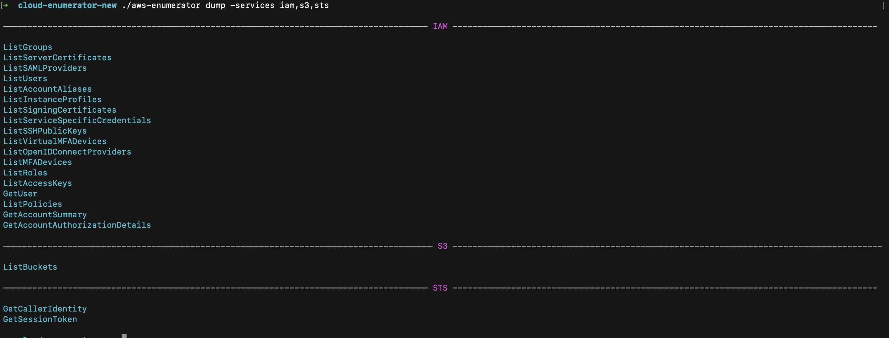
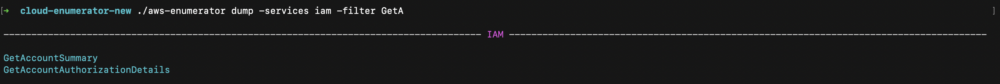
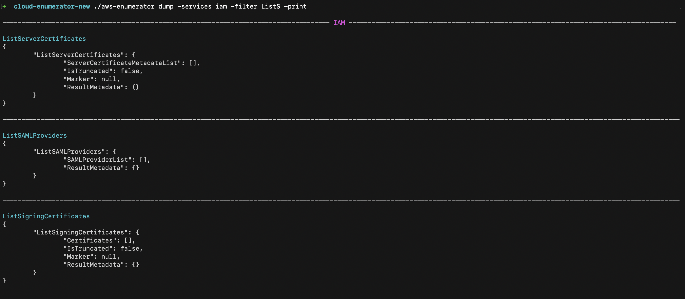

# AWS Service Enumeration

# Disclaimer

The tool is in beta stage (testing in progress), no destructive API Calls used ( read only actions ).
I hope, there will be no issues with the tool. If any issues encountered, please submit the ticket. 

# Description

The AWS Enumerator was created for service enumeration and info dumping for investigations of penetration testers during Black-Box  testing. The tool is intended to speed up the process of Cloud review in case the security researcher compromised AWS Account Credentials. 

AWS Enumerator supports more than 600 API Calls ( reading actions `Get`,  `List`, `Describe` etc... ), and will be extended. 

The tool provides interface for result analysis. All results are saved in json files (one time "Database").

# Install

If you have Go installed and configured (i.e. with `$GOPATH/bin` in your `$PATH`):

```
go get -u github.com/shabarkin/aws-enumerator
```
```
go install -v github.com/shabarkin/aws-enumerator@latest
```

# Basic Usage

## Credentials setup

To setup credentials, you should use cred subcommand and supply credentials: 

```bash
./aws-enumerator cred -aws_access_key_id AKIA***********XKU -aws_region us-west-2 -aws_secret_access_key kIm6m********************5JPF
```


It creates `.env` file, which is loaded to global variables each time you call `enum` subcommand.

**WARNING:** If you set these values `AWS_REGION`, `AWS_ACCESS_KEY_ID`, `AWS_SECRET_ACCESS_KEY`, `AWS_SESSION_TOKEN` in global variables manually before running the tool, it will not be able to load AWS Credentials specified in `.env` file ( It can't overwrite global variables ).

## Enumeration

To enumerate all services, you should use enum subcommand and supply all value or iam,s3,sts,rds ( no spaces between commas ), etc. ...

```bash
./aws-enumerator enum -services all
```

 If you want to check specific services (up to 10 ):

```bash
./aws-enumerator enum -services iam,sts,rds
```


(`-speed` flag is optional, the default value is `normal` ) There are 3 options `slow`, `normal`, `fast` 

```bash
./aws-enumerator enum -services all -speed slow
```

## Analysis

To analyse the collected information, you should use `dump` subcommand: ( Use `all` for quick overview of available API calls )

```bash
./aws-enumerator dump -services all
```


Analyze specific services (up to 10) `iam,s3,sts`, etc ...

```bash
./aws-enumerator dump -services iam,s3,sts
```



To filter API calls, you should use `-filter` option, start typing the name of API call (`GetA` ...):

```bash
./aws-enumerator dump -services iam -filter GetA
```



To retrieve the result of API call, you should use `-print` option

```bash
./aws-enumerator dump -services iam -filter ListS -print
```



## Demo Video

[Pavel Shabarkin LinkedIn](https://www.linkedin.com/posts/pavelshabarkin_cybersecurity-hacking-awssecurity-activity-6785479892881416192-O29U/)
